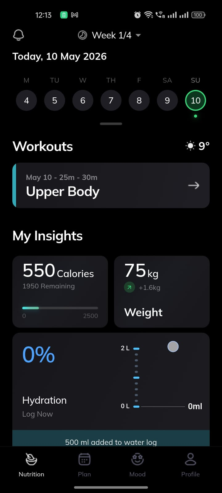
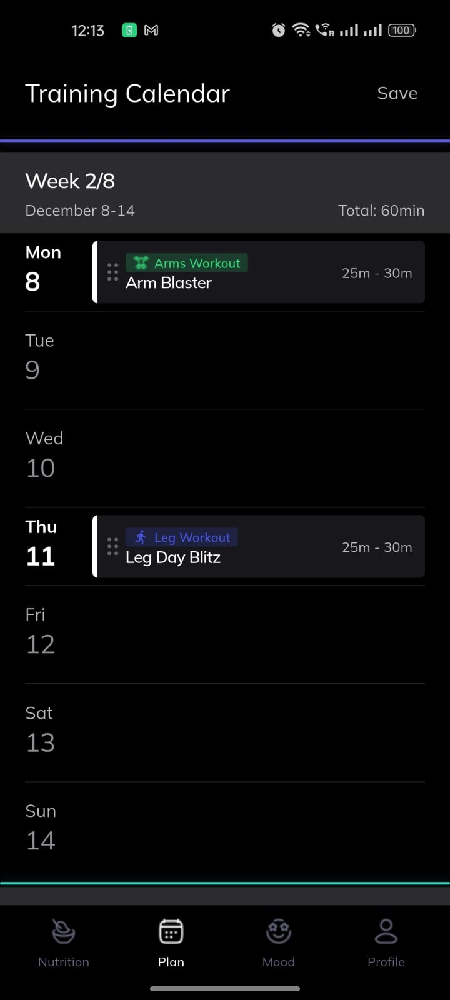
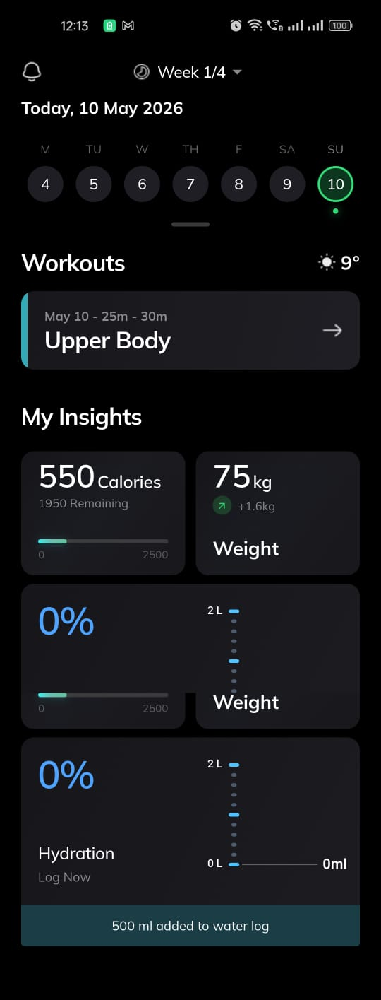
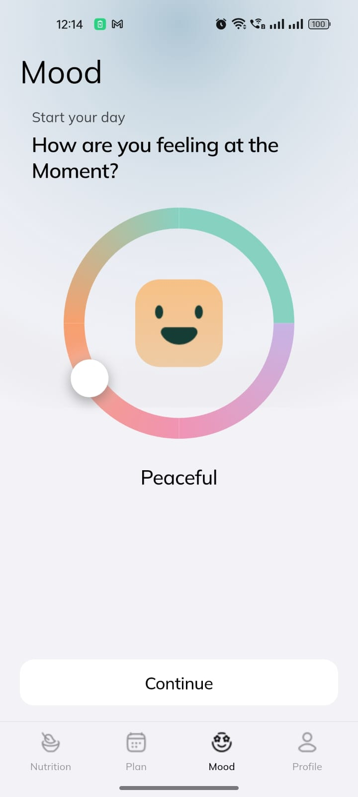
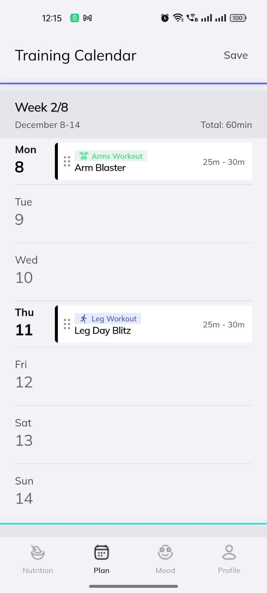
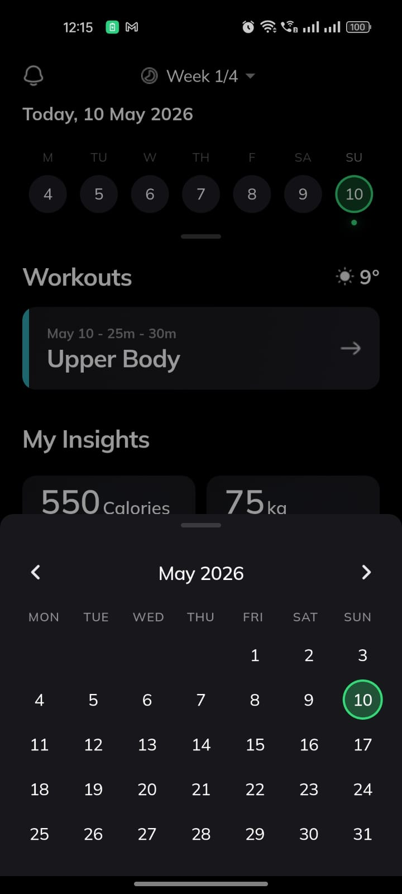
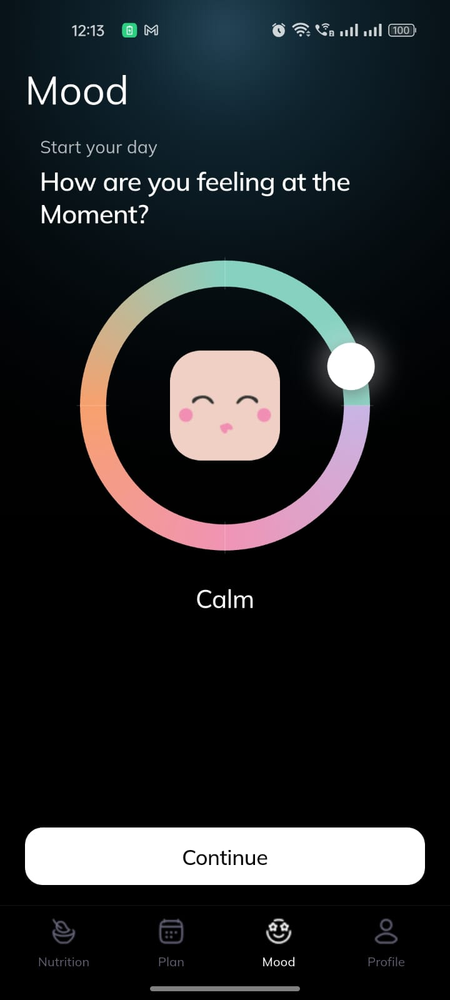

# Evencir Mood App

---

## Links

**APK**

Primary (hosted): **[Download APK (Google Drive)](REPLACE_WITH_GOOGLE_DRIVE_APK_LINK)** — paste your Drive share URL (shape: `https://drive.google.com/file/d/<FILE_ID>/view?usp=sharing`). If that link stops working:

- **Build on your PC** — from this repo root, run `flutter pub get` then `flutter build apk --release --split-per-abi`. Install the output for most phones: `build/app/outputs/flutter-apk/app-arm64-v8a-release.apk` (that path is relative to your clone).
- **Full paths:** after cloning, Android Studio / File Explorer: `<your-clone-folder>\build\app\outputs\flutter-apk\app-arm64-v8a-release.apk` on Windows; `<your-clone-folder>/build/app/outputs/flutter-apk/app-arm64-v8a-release.apk` on macOS or Linux.
- **GitHub Releases** (optional): upload the built APK and link it. Example URL shape: `https://github.com/<username>/<repo>/releases/download/v1.0.0/app-arm64-v8a-release.apk`

**Video**

[Watch app demo (Google Drive)](https://drive.google.com/file/d/11JpeUSC8elsXFflb3HrjM3_cM1h5HSG1/view?usp=sharing)

**Screenshots**

Jump to **[Screenshots](#screenshots)** below, or open the folder on GitHub: [screenshots/](./screenshots/).

---

## Dependencies

**Runtime**

Only **Flutter** from the SDK runs the UI (Material widgets, gestures, themes). Fonts and PNGs live in **assets**, set in **pubspec.yaml**. No extra pub packages beyond that.

**Dev only**

**flutter_test** — runs widget tests under **test/**.

**flutter_lints** — basic rules from **analysis_options.yaml**.

---

## Folder layout (high level)

```
lib/
├── core/
├── features/
├── main.dart
assets/
├── fonts/
├── icons/
screenshots/
android/
ios/
linux/
macos/
web/
windows/
test/
```

What's inside, in short commas:

- **lib** — all Dart UI, **`main.dart`** for startup and **`MaterialApp`** (light/dark).
- **`lib/core/theme`** — `app_assets.dart`, `fitness_fonts.dart`, `fitness_palette.dart`, `fitness_theme.dart` (themes, palette extension, typography, radius tokens, asset path constants).
- **`lib/features/shell/presentation`** — `app_shell.dart`, `fitness_bottom_navigation.dart`.
- **`lib/features/home/presentation`** — `fitness_home_screen.dart`, plus **`widgets`** with `glass_stat_card.dart`, `insight_cards.dart`, `featured_workout_card.dart`, `weekly_calendar_row.dart`, `month_calendar_bottom_sheet.dart`.
- **`lib/features/plan/presentation`** — `plan_screen.dart`, `training_calendar_widgets.dart`.
- **`lib/features/mood/presentation`** — `mood_screen.dart`, `mood_gradient_ring.dart`.

- **`assets/fonts/static`** — Mulish TTFs (weights in pubspec).
- **`assets/icons`** — PNGs (nav, moods, bells, calendars, arrows, workouts, daylight icon, etc.).
- **`assets`** — fonts folder, icons folder, anything else bundled in pubspec assets.
- **`screenshots`** — app screen captures (**`ss_*.jpeg`**) embedded in **[Screenshots](#screenshots)** with `./screenshots/` links for GitHub.

- **android** — Gradle wrapper, manifests, Kotlin/Java host for the APK.
- **ios** — Xcode project and iOS plist / assets Flutter needs.
- **linux**, **macos**, **web**, **windows** — each platform's runner scaffold for desktop or web builds.

- **test** — `widget_test.dart` and future tests Flutter runs via `flutter test`.

---

## Screenshots

Images live in **`screenshots/`**. On GitHub, paths like `./screenshots/ss_01.jpeg` open from **your repo on that branch**.

Tap a thumb to open the full file.

[](./screenshots/ss_01.jpeg)

[](./screenshots/ss_02.jpeg)

[](./screenshots/ss_03.jpeg)

[](./screenshots/ss_04.jpeg)

[](./screenshots/ss_05.jpeg)

[](./screenshots/ss_06.jpeg)

[](./screenshots/ss_07.jpeg)

[Browse screenshots folder](./screenshots/)

---

## Run on your machine

```
flutter pub get
flutter run
```
